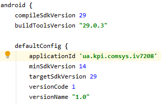
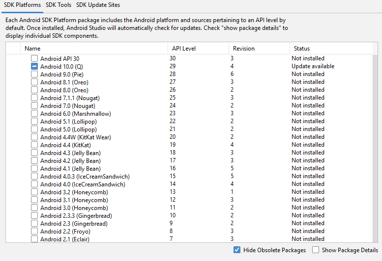
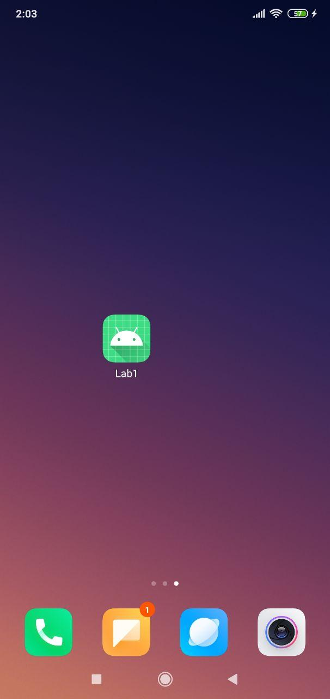
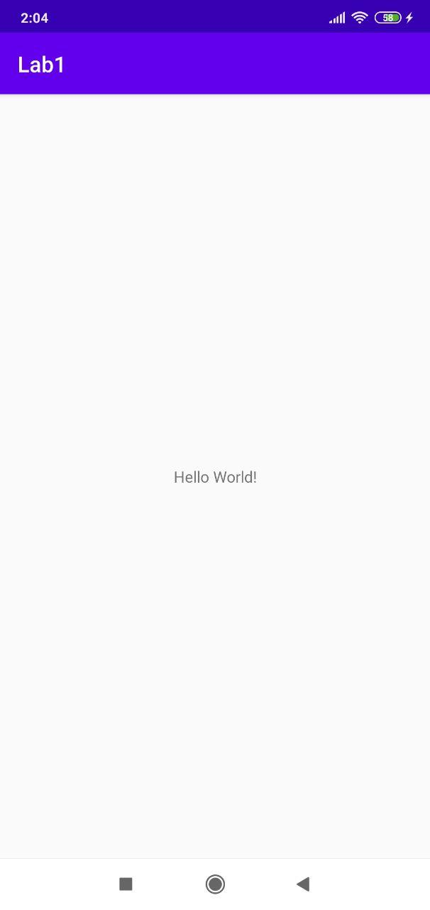

# MobDev_Lab1

### Step 5

### Step 6
/n

The app is configured to run smoothly on android 10. The oldest supported version is android 4.0(see screenshot from step 5 for minimal sdk requirement.

### Step 9

### Step 10

